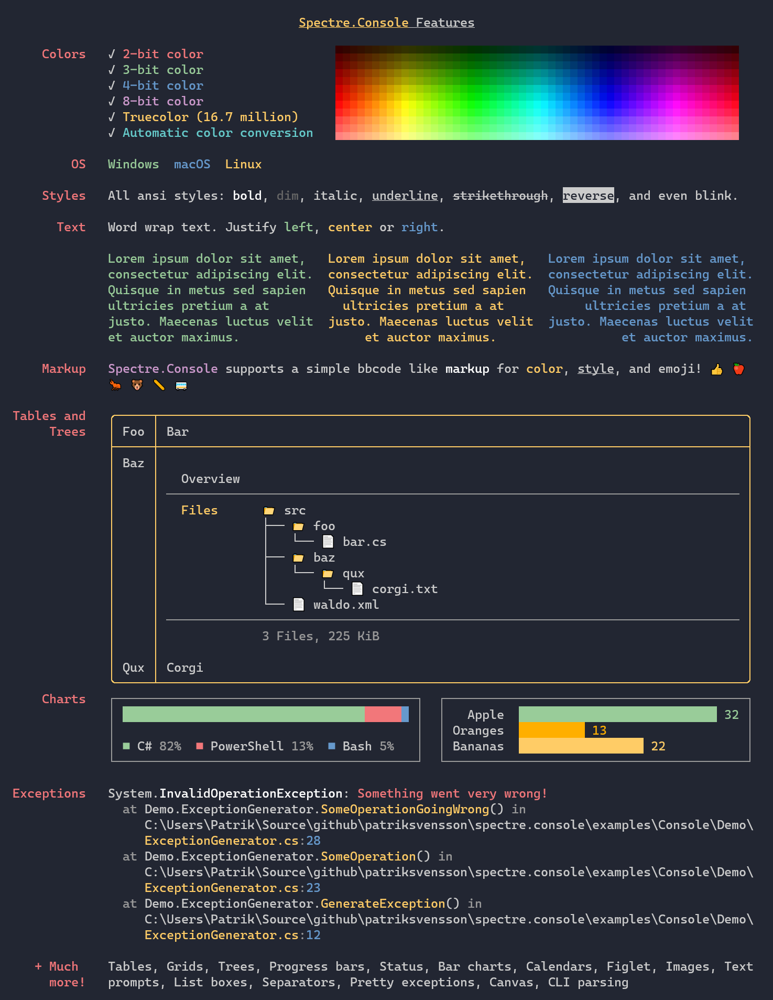

# `Spectre.Console`

__

یک کتابخانه .NET. که ایجاد Console Applicationهای زیبا و cross platform را آسان‌تر می‌کند.  
از کتابخانه عالی [Rich](https://github.com/willmcgugan/rich)  برای پایتون، بسیار الهام گرفته شده است.

## فهرست

1. [امکانات](#features)
2. [نصب](#installing)
3. [مستندات](#documentation)
4. [مثال‌ها](#examples)
5. [مجوز](#license)

<h2 id="features">امکانات</h2>

* با در نظر گرفتن تست واحد نوشته شده است.
* جداول، چارچوب‌ها، پنل‌ها و یک زبان نشانه گذاری که از [rich](https://github.com/willmcgugan/rich) الهام گرفته شده است را پشتیبانی می‌کند.
* از رایج ترین پارامترهای SRG در هنگام فرم دهی متن مانند پررنگ، کم نور، اریب، زیرخط، خط زدن و چشمک زدن پشتیبانی می‌کند.
* پشتیبانی از رنگ‌های 28/8/4/3-بیت در ترمینال.  
  این کتابخانه توانایی ترمینال فعلی را تشخیص داده و در صورت لزوم رنگ‌ها را کاهش می‌دهد.

<h2 id="installing">نصب</h2>

سریع ترین راه برای شروع `Spectre.Console` نصب از طریق NuGet Package می‌باشد.

<pre dir="ltr">
dotnet add package Spectre.Console
</pre>

<h2 id="documentation">مستندات</h2>

مستندات `Spectre.Console` را در اینجا می‌توایند پیدا کنید:

https://spectreconsole.net/

<h2 id="examples">مثال‌ها</h2>

برای بررسی `Spectre.Console` در عمل، ابزار سراسری
[dotnet-example](https://github.com/patriksvensson/dotnet-example)
را نصب کنید.

<pre dir="ltr">
> dotnet tool restore
</pre>

حالا شما می‌توانید مثال‌های موجود در این مخزن را لیست کنید:

<pre dir="ltr">
> dotnet example
</pre>

و برای اجرای مثال:

<pre dir="ltr">
> dotnet example tables
</pre>

<h2 id="license">مجوز</h2>

Copyright © Patrik Svensson, Phil Scott

همانطور که Spectre.Console تحت مجوز MIT ارائه شده است؛ برای کسب اطلاعات بیشتر به مجوز مراجعه کنید.

* برای SixLabors.ImageSharp، مشاهده کنید: https://github.com/SixLabors/ImageSharp/blob/master/LICENSE

