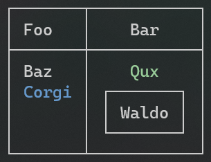
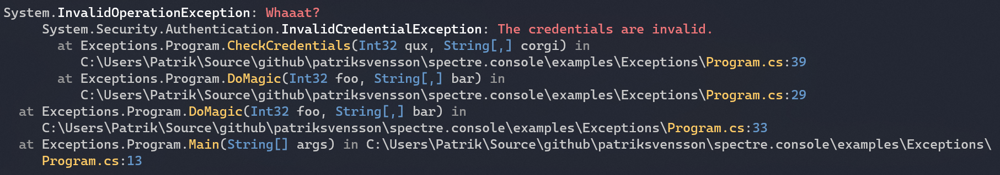
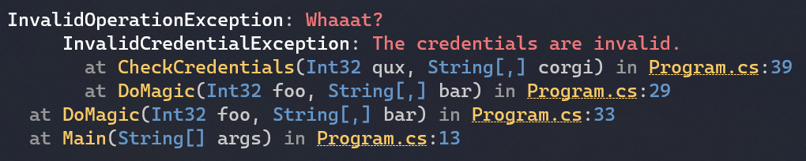
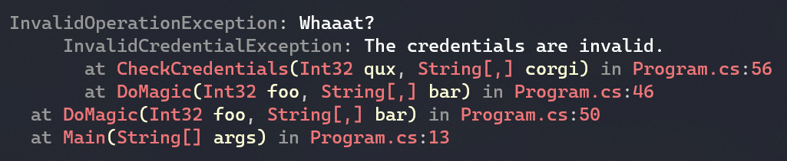

# `Spectre.Console`

_[](https://www.nuget.org/packages/spectre.console)_

綺麗なコンソールアプリケーションを簡単に作成するための.NETライブラリです。
Python用の素晴らしい[Rich ライブラリ](https://github.com/willmcgugan/rich)に強く影響を受けています。

## 目次

1. [特徴](#特徴)
2. [例](#例)
3. [使用方法](#使用方法)  
   3.1. [Static APIの利用](#static-apiの利用)  
   3.2. [コンソールの作成](#コンソールの作成)
4. [例の実行](#例の実行)
5. [クイックスタート](#クイックスタート)
6. [マークアップ](#マークアップ)
7. [絵文字](#絵文字)
8. [テーブル](#テーブル)
9. [例外](#例外)

## 特徴

* ユニットテストを意識して書いています。
* table、grid、panel、マークアップ言語に影響を受けた [rich](https://github.com/willmcgugan/rich) に対応しています。
* 太字、薄字、斜字、下線、斜線、点滅などの一般的なSGR parameters に対応しています。
* ターミナルで 3/4/8/24ビットカラーに対応しています。
  ライブラリは現在のターミナルの性能を検知し、必要なカラーにダウングレードします

## 例


## 使用方法

`Spectre.Console` APIはステートフルで、スレッドセーフではありません。
異なるスレッドからコンソールに書く必要がある場合、通常の`System.Console` APIを使用するときと同様、適切な注意を払ってください。

現在の端末がANSIエスケープシーケンスに対応していない場合、
`Spectre.Console`は、`System.Console` APIの利用に切り替わります。

_メモ: このライブラリは現在開発中で、APIは1.0のリリースまでの間に変更されたり、
削除されたりする可能性があります。_

### Static APIの利用


`System.Console` APIでするように、テキストを出力したいだけの時にはstatic APIが最適ですが、綺麗です。

```csharp
AnsiConsole.Foreground = Color.CornflowerBlue;
AnsiConsole.Decoration = Decoration.Underline | Decoration.Bold;
AnsiConsole.WriteLine("Hello World!");

AnsiConsole.Reset();
AnsiConsole.MarkupLine("[bold yellow on red]{0}[/] [underline]world[/]!", "Goodbye");
```

もし、デフォルトの`IAnsiConsole`への参照を取得したい場合、
`AnsiConsole.Console`経由でアクセスできます。

### コンソールの作成

単体テスト中にコードの実行環境を制御したい場合など、
特定の機能をもつコンソールを明示的に作成すると便利なことがあります。

単体テストの一部としてコードで `AnsiConsole`を使わないことを推奨します。

```csharp
IAnsiConsole console = AnsiConsole.Create(
    new AnsiConsoleSettings()
    {
        Ansi = AnsiSupport.Yes,
        ColorSystem = ColorSystemSupport.TrueColor,
        Out = new StringWriter(),
    });
```

_メモ: 主導でコンソールを作成しているときに特定のカラーシステムを指定できたとしても、
ユーザーのターミナルでは使えないかもしれないことを覚えておいてください。
テスト用にIAnsiConsoleを作成していない限り、
常に`ColorSystemSupport.Detect` と `AnsiSupport.Detect`を使用してください。_

## 例の実行

Spectre.Consoleでできることを見るために、 
[dotnet-example](https://github.com/patriksvensson/dotnet-example)グローバルツールをインストールします。


```
> dotnet tool restore
```

このリポジトリで提供している例が一覧表示されます

```
> dotnet example

╭────────────┬───────────────────────────────────────┬──────────────────────────────────────────────────────╮
│ Name       │ Path                                  │ Description                                          │
├────────────┼───────────────────────────────────────┼──────────────────────────────────────────────────────┤
│ Borders    │ examples/Borders/Borders.csproj       │ Demonstrates the different kind of borders.          │
│ Calendars  │ examples/Calendars/Calendars.csproj   │ Demonstrates how to render calendars.                │
│ Colors     │ examples/Colors/Colors.csproj         │ Demonstrates how to use colors in the console.       │
│ Columns    │ examples/Columns/Columns.csproj       │ Demonstrates how to render data into columns.        │
│ Emojis     │ examples/Emojis/Emojis.csproj         │ Demonstrates how to render emojis.                   │
│ Exceptions │ examples/Exceptions/Exceptions.csproj │ Demonstrates how to render formatted exceptions.     │
│ Grids      │ examples/Grids/Grids.csproj           │ Demonstrates how to render grids in a console.       │
│ Info       │ examples/Info/Info.csproj             │ Displays the capabilities of the current console.    │
│ Links      │ examples/Links/Links.csproj           │ Demonstrates how to render links in a console.       │
│ Panels     │ examples/Panels/Panels.csproj         │ Demonstrates how to render items in panels.          │
│ Rules      │ examples/Rules/Rules.csproj           │ Demonstrates how to render horizontal rules (lines). │
│ Tables     │ examples/Tables/Tables.csproj         │ Demonstrates how to render tables in a console.      │
│ Trees      │ examples/Trees/Trees.csproj           │ Demonstrates how to render trees in a console.       │
╰────────────┴───────────────────────────────────────┴──────────────────────────────────────────────────────╯
```

そして、例を実行します

```
> dotnet example tables
┌──────────┬──────────┬────────┐
│ Foo      │ Bar      │ Baz    │
├──────────┼──────────┼────────┤
│ Hello    │ World!   │        │
│ Bonjour  │ le       │ monde! │
│ Hej      │ Världen! │        │
└──────────┴──────────┴────────┘
```

## クイックスタート
pectre.Consoleの利用を開始する最初の方法は、Nugetパッケージをインストールすることです。

```shell
> dotnet add package Spectre.Console
```

その後、`Spectre.Console`名前空間を参照する必要があります。一度参照したら、提供されている全ての機能を使用できます。

```csharp
using Spectre.Console

public static class Program
{
    public static void Main(string[] args)
    {
        AnsiConsole.Markup("[underline red]Hello[/] World!");
    }
}
```

## マークアップ
`Markup`クラスは、コンソールにリッチなテキストを出力することができます。

### 文法

コンソールマークアップはbbcodeに影響を受けた文法を利用します。角括弧でスタイルを書いたら（スタイルを参照）、例えば、`[bold red]`
は、`[/]`で閉じるまでスタイルが適用されます。

```csharp
AnsiConsole.Render(new Markup("[bold yellow]Hello[/] [red]World![/]"));
```

`Markup` クラスは`IRenderable`を実装しており、table、grid、Panelを使用できることを意味します。
`IRenderable`のレンダリングに対応している多くのクラスは、リッチテキストの描画を上書きます。

```csharp
var table = new Table();
table.AddColumn(new TableColumn(new Markup("[yellow]Foo[/]")));
table.AddColumn(new TableColumn("[blue]Bar[/]"));
```

### 便利なメソッド

`AnsiConsole`には、新しい`Markup`インスタンスをインスタンス化することなく、コンソールにマークアップテキストを書き込める便利なメソッドがあります。

```csharp
AnsiConsole.Markup("[underline green]Hello[/] ");
AnsiConsole.MarkupLine("[bold]World[/]");
```

### エスケープ文字列

`[`を出力するために、 `[[`を利用し、`]`を出力するために`]]`を利用します。

```csharp
AnsiConsole.Markup("[[Hello]] "); // [Hello]
AnsiConsole.Markup("[red][[World]][/]"); // [World]
```

`SafeMarkup`拡張メソッドを使用することもできます。

```csharp
AnsiConsole.Markup("[red]{0}[/]", "Hello [World]".SafeMarkup());
```

### カラー

`new Style(foreground: Color.Maroon)`のようなコード、または、`AnsiConsole.Markup("[maroon on blue]Hello[/]")`のようなマークアップテキストで色を使用できます。

### 背景色の設定

カラー指定の際に、`on`を付けることで、マークアップで背景色を設定できます。

```
[bold yellow on blue]Hello[/]
[default on blue]World[/]
```

### 絵文字の描画

マークアップの一部として絵文字を出力するために、emojiショートコードが使用できます。

```csharp
AnsiConsole.MarkupLine("Hello :globe_showing_europe_africa:!");
```

emojiのスタイルについては、付録の[Emoji](./appendix/emojis) を参照してください。

### カラー

上の例では、全ての色は名前で参照されています。
しかし、16進数やRGB表現をマークダウンで色指定に使用できます。

```csharp
AnsiConsole.Markup("[red]Foo[/] ");
AnsiConsole.Markup("[#ff0000]Bar[/] ");
AnsiConsole.Markup("[rgb(255,0,0)]Baz[/] ");
```

## 絵文字

どのような絵文字が使用できるかは、使用しているOSやターミナルに依存し、どのように表示されるかは保証されません。絵文字の幅計算は正確ではないため、表、パネル、グリッドで使用する場合は表示がずれるかもしれません。

完全な互換性を確保するために、Unicode 13.0 より以前の`Emoji_Presentation`カテゴリにあるものだけを使用することを検討してください。
公式の絵文字一覧
https://www.unicode.org/Public/UCD/latest/ucd/emoji/emoji-data.txt


```csharp
// Markup
AnsiConsole.MarkupLine("Hello :globe_showing_europe_africa:!");

// Constant
var hello = "Hello " + Emoji.Known.GlobeShowingEuropeAfrica;
```

テキスト内の絵文字を置き換えることができます。

```csharp
var phrase = "Mmmm :birthday_cake:";
var rendered
```

既存の絵文字を別のものにしたり、完全に新しい物を追加したいことがあります。このために、`Emoji.Remap`メソッドを使用できます。
この方法は、マークアップ文字と`Emoji.Replace`の両方で動作します。

```csharp
// Remap the emoji
Emoji.Remap("globe_showing_europe_africa", "😄");

// Render markup
AnsiConsole.MarkupLine("Hello :globe_showing_europe_africa:!");

// Replace emojis in string
var phrase = "Hello :globe_showing_europe_africa:!";
var rendered = Emoji.Replace(phrase);
```

## テーブル

テーブルはターミナルで表データを表示するのに完璧な方法です。
`Spectre.Console` は、テーブルの描画にとても優れていて、全てのカラムは中に合わせて調整してくれます。
`IRenderable`を実装しているものは、列ヘッダやセル、別のテーブルとして使用できます。

### 使い方

テーブルを描画するために、`Table`インスタンスを作成し、必要な数の列を追加し、行を追加します。
テーブルをコンソールの`Render`メソッドに渡して終わりです。

```csharp
// テーブルの作成
var table = new Table();

// 列の追加
table.AddColumn("Foo");
table.AddColumn(new TableColumn("Bar").Centered());

// 行の追加
table.AddRow("Baz", "[green]Qux[/]");
table.AddRow(new Markup("[blue]Corgi[/]"), new Panel("Waldo"));

// コンソールにテーブルの描画
AnsiConsole.Render(table);
```

これは次のように出力を描画します。



### 罫線


```csharp
// 罫線を設定します
table.SetBorder(Border.None);
table.SetBorder(Border.Ascii);
table.SetBorder(Border.Square);
table.SetBorder(Border.Rounded);
```

### 拡大 / 縮小

```csharp
// テーブル幅を最大に設定します
table.Expand();

// テーブル幅を最小に設定します
table.Collapse();
```

### ヘッダーを隠す

```csharp
// 全ての列のヘッダーを隠します
table.HideHeaders();
```

### テーブル幅の設定

```csharp
// テーブル幅50セルに設定します
table.SetWidth(50);
```

### 整列（アライメント）

```csharp
// 整列を明示的に設定する
column.SetAlignment(Justify.Right);
```

### パディング

```csharp
// 左と右のパディングを設定する
column.SetPadding(left: 3, right: 5);

// 個別にパディングを設定する
column.PadLeft(3);
column.PadRight(5);
```

### 列改行の無効化

```csharp
// 列改行の無効化
column.NoWrap();
```

### 列幅の設定

```csharp
// 列幅の設定(これはまだ柔軟な拡張メソッドがありません)
column.Width = 15;
```

## 例外
例外はターミナルで見たときに読みやすいとは限りません。
`WriteException`メソッドを使用することで、例外をもう少し読みやすくすることができます。

```csharp
AnsiConsole.WriteException(ex);
```


### 例外の省略表示

例外の特定部分を短くして、さらに読みやすくしたり、パスをクリック可能なハイパーリンクにすることもできます。
ハイパーリンクがクリックできるかはターミナル次第です。


```csharp
AnsiConsole.WriteException(ex, 
    ExceptionFormats.ShortenPaths | ExceptionFormats.ShortenTypes |
    ExceptionFormats.ShortenMethods | ExceptionFormats.ShowLinks);
```



### 例外出力のカスタマイズ

例外の特定部分を短縮するだけでなく、デフォルトのスタイルを上書きすることもできます。

```csharp
AnsiConsole.WriteException(ex, new ExceptionSettings
{
    Format = ExceptionFormats.ShortenEverything | ExceptionFormats.ShowLinks,
    Style = new ExceptionStyle
    {
        Exception = Style.WithForeground(Color.Grey),
        Message = Style.WithForeground(Color.White),
        NonEmphasized = Style.WithForeground(Color.Cornsilk1),
        Parenthesis = Style.WithForeground(Color.Cornsilk1),
        Method = Style.WithForeground(Color.Red),
        ParameterName = Style.WithForeground(Color.Cornsilk1),
        ParameterType = Style.WithForeground(Color.Red),
        Path = Style.WithForeground(Color.Red),
        LineNumber = Style.WithForeground(Color.Cornsilk1),
    }
});
```

