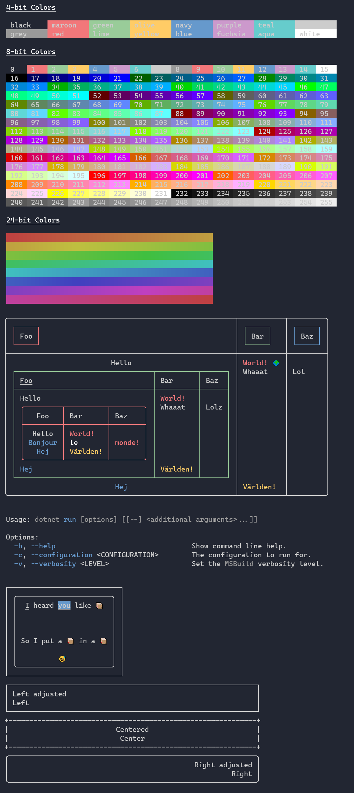

# `Spectre.Console`

_[](https://www.nuget.org/packages/spectre.console)_

A .NET Standard 2.0 library that makes it easier to create beautiful console applications.  
It is heavily inspired by the excellent [Rich library](https://github.com/willmcgugan/rich) 
for Python.

## Table of Contents

1. [Features](#features)
2. [Example](#example)
3. [Usage](#usage)  
   3.1. [Using the static API](#using-the-static-api)  
   3.2. [Creating a console](#creating-a-console)
4. [Running examples](#running-examples)

## Features

* Written with unit testing in mind.
* Supports tables, grids, panels, and a [rich](https://github.com/willmcgugan/rich) inspired markup language.
* Supports the most common SRG parameters when it comes to text 
  styling such as bold, dim, italic, underline, strikethrough, 
  and blinking text.
* Supports 3/4/8/24-bit colors in the terminal.  
  The library will detect the capabilities of the current terminal 
  and downgrade colors as needed.

## Example



## Usage

The `Spectre.Console` API is stateful and is not thread-safe.
If you need to write to the console from different threads, make sure that 
you take appropriate precautions, just like when you use the 
regular `System.Console` API.

If the current terminal does not support ANSI escape sequences, 
`Spectre.Console` will fallback to using the `System.Console` API.

_NOTE: This library is currently under development and API's 
might change or get removed at any point up until a 1.0 release._

### Using the static API

The static API is perfect when you just want to output text
like you usually do with the `System.Console` API, but prettier.

```csharp
AnsiConsole.Foreground = Color.CornflowerBlue;
AnsiConsole.Decoration = Decoration.Underline | Decoration.Bold;
AnsiConsole.WriteLine("Hello World!");

AnsiConsole.Reset();
AnsiConsole.MarkupLine("[bold yellow on red]{0}[/] [underline]world[/]!", "Goodbye");
```

If you want to get a reference to the default `IAnsiConsole`, 
you can access it via `AnsiConsole.Console`.

### Creating a console

Sometimes it's useful to explicitly create a console with specific 
capabilities, such as during unit testing when you want control 
over the environment your code runs in. 

It's recommended to not use `AnsiConsole` in code that run as 
part of a unit test.

```csharp
IAnsiConsole console = AnsiConsole.Create(
    new AnsiConsoleSettings()
    {
        Ansi = AnsiSupport.Yes,
        ColorSystem = ColorSystemSupport.TrueColor,
        Out = new StringWriter(),
    });
```

_NOTE: Even if you can specify a specific color system to use 
when manually creating a console, remember that the user's terminal 
might not be able to use it, so unless you're creating an IAnsiConsole 
for testing, always use `ColorSystemSupport.Detect` and `AnsiSupport.Detect`._

## Running examples

To see Spectre.Console in action, install the 
[dotnet-example](https://github.com/patriksvensson/dotnet-example)
global tool.

```
> dotnet tool install -g dotnet-example
```

Now you can list available examples in this repository:

```
> dotnet example

╭────────┬───────────────────────────────┬─────────────────────────────────────────────────╮
│ Name   │ Path                          │ Description                                     │
├────────┼───────────────────────────────┼─────────────────────────────────────────────────┤
│ Colors │ examples/Colors/Colors.csproj │ Demonstrates how to use colors in the console.  │
│ Grid   │ examples/Grid/Grid.csproj     │ Demonstrates how to render grids in a console.  │
│ Panel  │ examples/Panel/Panel.csproj   │ Demonstrates how to render items in panels.     │
│ Table  │ examples/Table/Table.csproj   │ Demonstrates how to render tables in a console. │
╰────────┴───────────────────────────────┴─────────────────────────────────────────────────╯
```

And to run an example:

```
> dotnet example tables
┌──────────┬──────────┬────────┐
│ Foo      │ Bar      │ Baz    │
├──────────┼──────────┼────────┤
│ Hello    │ World!   │        │
│ Bonjour  │ le       │ monde! │
│ Hej      │ Världen! │        │
└──────────┴──────────┴────────┘
```