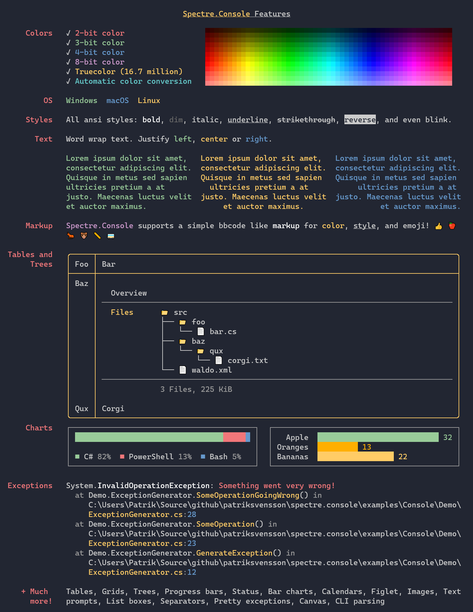

# `Spectre.Console`

_[](https://www.nuget.org/packages/spectre.console)_

Uma biblioteca .NET que torna mais fácil criar aplicativos de console bonitos e multiplataforma. 
É fortemente inspirada na excelente [biblioteca Rich](https://github.com/willmcgugan/rich) 
para Python.

## Índice de Conteúdo

1. [Funcionalidades](#funcionalidades)
1. [Instalação](#instalação)
1. [Documentação](#documentação)
1. [Exemplos](#exemplos)
1. [Licença](#licença)

## Funcionalidades

* Desenvolvida com testes unitários em mente.
* Suporta tabelas, grades, painéis, e uma linguagem de marcação inspirada em [rich](https://github.com/willmcgugan/rich).
* Suporta os parâmetros SGR mais comuns quando se trata de estilo de texto, 
  como negrito, esmaecido, itálico, sublinhado, tachado 
  e texto piscando.
* Suporta cores de 3/4/8/24 bits no terminal.
  A biblioteca detectará os recursos do terminal atual 
  e reduz as cores conforme necessário.



## Instalação

A maneira mais rápida de começar a usar o `Spectre.Console` é instalar o pacote NuGet.

```csharp
dotnet add package Spectre.Console
```

## Documentação

A documentação do `Spectre.Console` pode ser encontrada em 
https://spectreconsole.net/

## Exemplos

To see `Spectre.Console` in action, please see the 
[examples repository](https://github.com/spectreconsole/examples).

## Licença

Copyright © Patrik Svensson, Phil Scott, Nils Andresen, Cédric Luthi, Frank Ray

Spectre.Console é fornecido no estado em que se encontra sob a licença do MIT. Para obter mais informações, consulte o arquivo [LICENSE](LICENSE.md).

* Para SixLabors.ImageSharp, consulte https://github.com/SixLabors/ImageSharp/blob/master/LICENSE