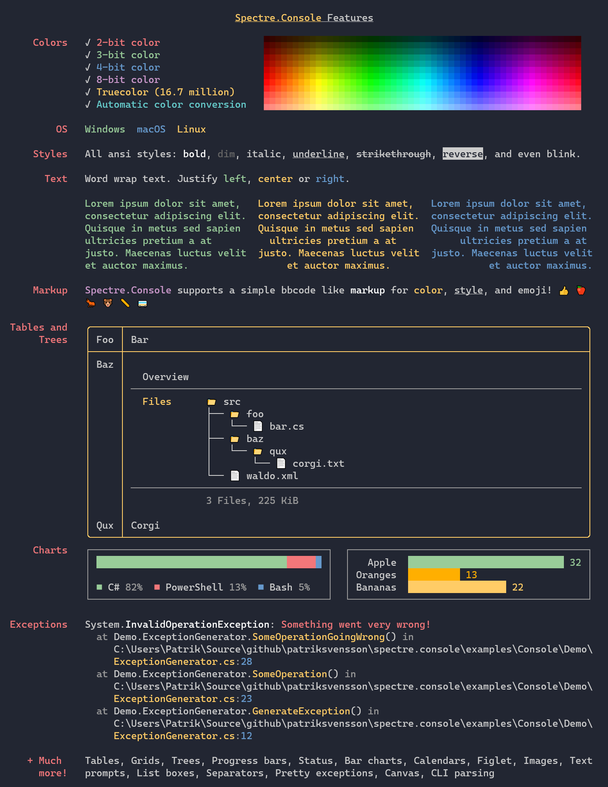

# `Spectre.Console`

_[](https://www.nuget.org/packages/spectre.console)_

> **Not:** Bu sayfa [İngilizce README](https://github.com/spectreconsole/spectre.console/blob/main/README.md) dosyasının Türkçe çevirisidir. Güncel bilgiler için orijinal İngilizce dokümantasyona başvurunuz.

Şık ve çapraz platform konsol uygulamaları geliştirmeyi kolaylaştıran bir .NET kütüphanesi.
Python için geliştirilmiş harika [Rich](https://github.com/willmcgugan/rich) kütüphanesinden büyük ölçüde ilham almıştır.
`Spectre.Console` kullanımıyla ilgili ayrıntılı talimatlara projenin web sitesinden ulaşabilirsiniz: https://spectreconsole.net

## İçindekiler

1. [Özellikler](#özellikler)
1. [Önemli Bildirimler](#önemli-bildirimler)
1. [Kurulum](#kurulum)
1. [Dokümantasyon](#dokümantasyon)
1. [Örnekler](#örnekler)
1. [Davranış Kuralları](#davranış-kuralları)
1. [.NET Foundation](#net-foundation)
1. [Lisans](#lisans)

## Özellikler

* Tablolar, ızgaralar, paneller ve [Rich](https://github.com/willmcgugan/rich) esintili bir işaretleme dilini destekler.
* Kalın, soluk, italik, altı çizili, üstü çizili ve yanıp sönen metin gibi
  en yaygın SGR parametrelerini destekler.
* Terminalde 3/4/8/24-bit renkleri destekler.
  Kütüphane, mevcut terminalin yeteneklerini algılar
  ve renkleri gerektiğinde düşürür.
* Birim testi öncelikli olarak yazılmıştır.



## Önemli Bildirimler

> [!IMPORTANT]\
> Topluluk talebini takip etmek için [En Çok Talep Edilen Konular Panosu'nu](https://github.com/spectreconsole/spectre.console/issues/1517) kullanıyoruz. Lütfen ilgilendiğiniz konuları (issues) ve pull request'leri :+1: oylayın.

## Kurulum

`Spectre.Console` kullanmaya başlamanın en hızlı yolu NuGet paketini yüklemektir.

```csharp
dotnet add package Spectre.Console
```

## Dokümantasyon

`Spectre.Console` dokümantasyonuna şu adresten ulaşabilirsiniz:
https://spectreconsole.net

## Örnekler

`Spectre.Console`'u çalışırken görmek için
[örnekler reposuna](https://github.com/spectreconsole/examples) göz atabilirsiniz.

## Davranış Kuralları

Bu proje, topluluğumuzda beklenen davranışları netleştirmek için Contributor Covenant tarafından tanımlanan davranış kurallarını benimsemiştir.
Daha fazla bilgi için [.NET Foundation Davranış Kuralları](https://dotnetfoundation.org/code-of-conduct) sayfasına bakınız.

## .NET Foundation

Bu proje [.NET Foundation](https://dotnetfoundation.org) tarafından desteklenmektedir.

## Lisans

Telif Hakkı © Patrik Svensson, Phil Scott, Nils Andresen, Cédric Luthi

`Spectre.Console` MIT lisansı altında olduğu gibi sunulmaktadır. Daha fazla bilgi için LICENSE dosyasına bakınız.

* `Spectre.Console` bünyesinde dağıtılan SixLabors.ImageSharp kütüphanesi Apache 2.0 lisanslıdır. Diğer tüm kullanımlar Six Labors Split License kapsamındadır, bkz: https://github.com/SixLabors/ImageSharp/blob/master/LICENSE
