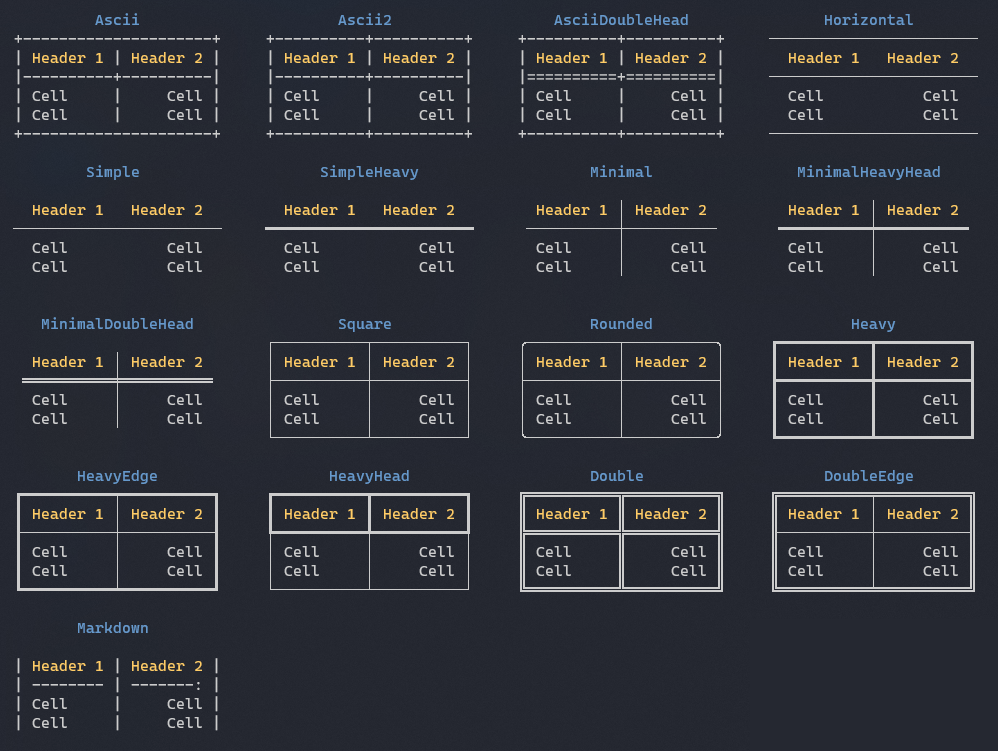
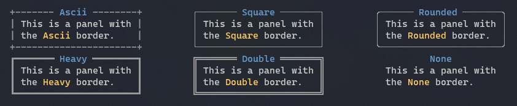

Title: Borders
Order: 2
---

There is different built-in borders you can use for tables and panels.

## Table borders



### Example

To set a table border to `SimpleHeavy`:

```csharp
var table = new Table();
table.Border = TableBorder.SimpleHeavy;
```

---

## Panel borders



### Example

To set a panel border to `Rounded`:

```csharp
var panel = new Panel("Hello World");
panel.Border = BoxBorder.Rounded;
```