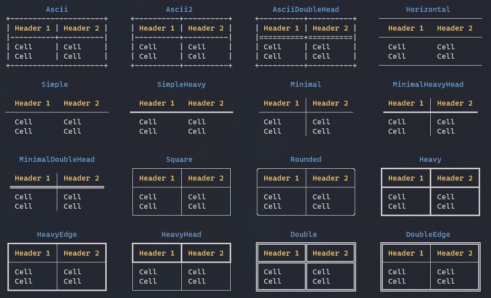

Title: Borders
Order: 2
---

There is different built-in borders you can use for tables and panels.

# Built-in borders



# Usage

To create a table and set it's border to `SimpleHeavy` as seen in the 
image above:

```csharp
var table = new Table();
table.Border = Border.SimpleHeavy;
```