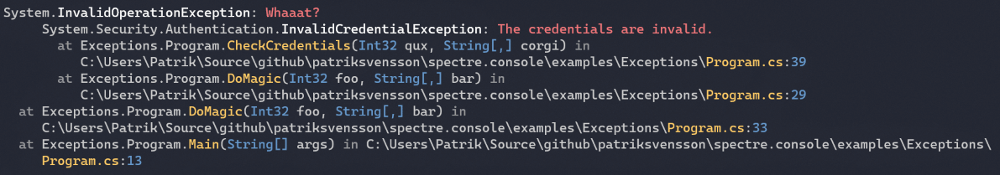

Title: Exceptions
Order: 3
---

Exceptions aren't always readable when viewed in the terminal.  
You can make exception a bit more readable by using the `WriteException` method.

```csharp
AnsiConsole.WriteException(ex);
```




## Shortening parts

You can also shorten specific parts of the exception to make it even
more readable, and make paths clickable hyperlinks. Whether or not
the hyperlinks are clickable is up to the terminal. 

```csharp
AnsiConsole.WriteException(ex, 
    ExceptionFormats.ShortenPaths | ExceptionFormats.ShortenTypes |
    ExceptionFormats.ShortenMethods | ExceptionFormats.ShowLinks);
```


## Customizing exception output

In addition to shorten specific part of the exception, you can 
also override the default styling.

```csharp
AnsiConsole.WriteException(ex, new ExceptionSettings
{
    Format = ExceptionFormats.ShortenEverything | ExceptionFormats.ShowLinks,
    Style = new ExceptionStyle
    {
        Exception = new Style().Foreground(Color.Grey),
        Message = new Style().Foreground(Color.White),
        NonEmphasized = new Style().Foreground(Color.Cornsilk1),
        Parenthesis = new Style().Foreground(Color.Cornsilk1),
        Method = new Style().Foreground(Color.Red),
        ParameterName = new Style().Foreground(Color.Cornsilk1),
        ParameterType = new Style().Foreground(Color.Red),
        Path = new Style().Foreground(Color.Red),
        LineNumber = new Style().Foreground(Color.Cornsilk1),
    }
});
```

