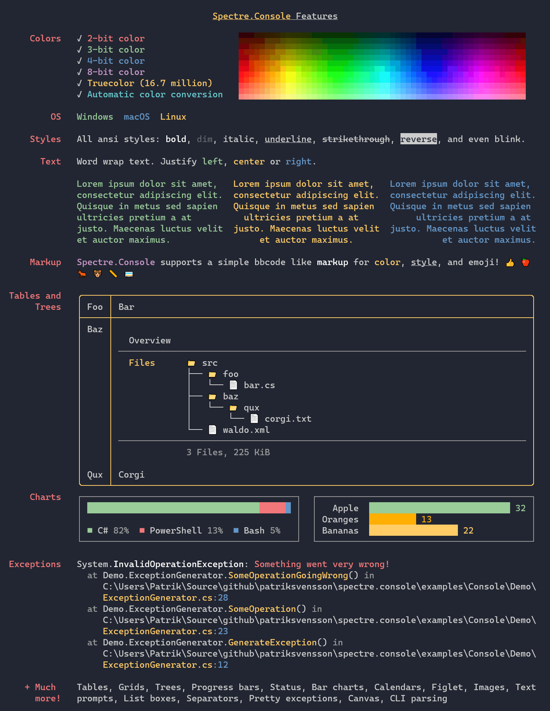

Title: Welcome!
Description: Spectre.Console is a .NET library that makes it easier to create beautiful console applications.
Order: 0
---

Spectre.Console is a `.NET` library that makes it easier 
to create beautiful console applications. 

## Spectre.Console.AnsiConsole Features

* Easily output text with different colors and even styles such as bold, italic and blinking with a Rich inspired [markup language](markup).
* Supports `3`/`4`/`8`/`24`-bit colors in the terminal with auto-detection of the current terminal's capabilities.
* Render complex [widgets](widgets) such as [tables](widgets/table), [trees](widgets/tree), and even [ASCII images](widgets/canvas-image).
* Display progress for long running tasks with live displays of [progress](live/progress) and [status](live/status) controls.
* Prompt user input with strongly typed [text input](prompts/text) or via [single-item select](prompts/selection) and [multiple item select](prompts/multiselection) controls.
* Format .NET [exceptions](exceptions) with custom color coded themes and styles.
* Written with unit testing in mind.

Spectre.Console.AnsiConsole  has been heavily inspired 
by the excellent [Rich](https://github.com/willmcgugan/rich) library 
for Python written by Will McGugan.

## Spectre.Console.Cli

* Create strongly typed settings and commands for parsing `args[]` to create complex command line applications like `git`, `gh`, or `dotnet`

## Examples

<video autoplay muted loop class="mt-4">
    <source src="./assets/images/table.webm"
            type="video/webm">
    <source src="./assets/images/table.mp4"
            type="video/mp4">
    Sorry, your browser doesn't support embedded videos.
</video>

