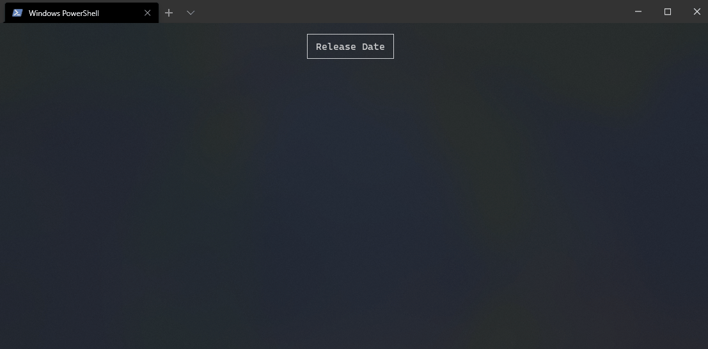

Title: Welcome
Order: 0
---

Spectre.Console is a `.NET Standard 2.0` library that makes it easier 
to create beautiful console applications. It has been heavily inspired 
by the excellent [Rich](https://github.com/willmcgugan/rich) library 
for Python written by Will McGugan.

## Features

* Written with unit testing in mind.
* Supports tables, grids, panels, and a [Rich](https://github.com/willmcgugan/rich) 
  inspired markup language.
* Supports the most common 
  [SGR parameters](https://en.wikipedia.org/wiki/ANSI_escape_code#SGR_parameters) 
  when it comes to text styling such as bold, dim, italic, underline, strikethrough, 
  and blinking text.
* Supports `3`/`4`/`8`/`24`-bit colors in the terminal.  
  The library will detect the capabilities of the current terminal 
  and downgrade colors as needed.

## Examples

