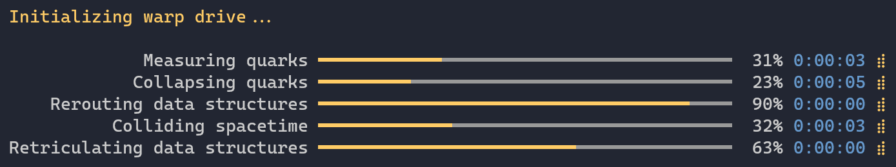
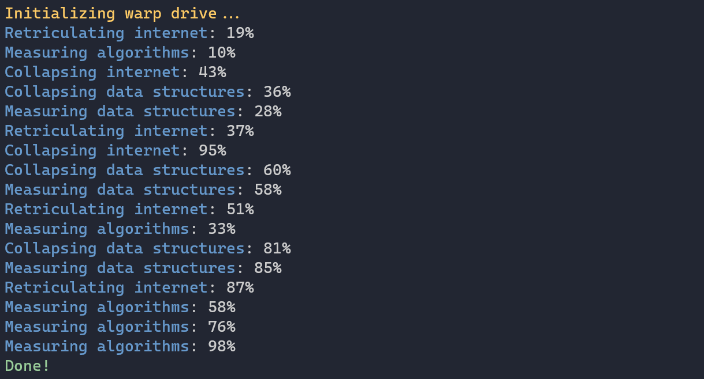

Title: Progress
Order: 5
RedirectFrom: progress
---

Spectre.Console can display information about long running tasks in the console. 



<div class="alert alert-warning" role="alert">
  <i class="fas fa-exclamation-triangle icon-web"></i> The progress display is not 
  thread safe, and using it together with other interactive components such as 
  prompts, status displays or other progress displays are not supported.
</div>

If the current terminal isn't considered "interactive", such as when running 
in a continuous integration system, or the terminal can't display 
ANSI control sequence, any progress will be displayed in a simpler way.



## Usage

```csharp
// Synchronous
AnsiConsole.Progress()
    .Start(ctx => 
    {
        // Define tasks
        var task1 = ctx.AddTask("[green]Reticulating splines[/]");
        var task2 = ctx.AddTask("[green]Folding space[/]");

        while(!ctx.IsFinished) 
        {
            task1.Increment(1.5);
            task2.Increment(0.5);
        }
    });
```

## Asynchronous progress

If you prefer to use async/await, you can use `StartAsync` instead of `Start`.

```csharp
// Asynchronous
await AnsiConsole.Progress()
    .StartAsync(async ctx =>
    {
        // Define tasks
        var task1 = ctx.AddTask("[green]Reticulating splines[/]");
        var task2 = ctx.AddTask("[green]Folding space[/]");

        while (!ctx.IsFinished)
        {
            // Simulate some work
            await Task.Delay(250);

            // Increment
            task1.Increment(1.5);
            task2.Increment(0.5);
        }
    });
```

## Configure

```csharp
// Asynchronous
AnsiConsole.Progress()
    .AutoRefresh(false) // Turn off auto refresh
    .AutoClear(false)   // Do not remove the task list when done
    .HideCompleted(false)   // Hide tasks as they are completed
    .Columns(new ProgressColumn[] 
    {
        new TaskDescriptionColumn(),    // Task description
        new ProgressBarColumn(),        // Progress bar
        new PercentageColumn(),         // Percentage
        new RemainingTimeColumn(),      // Remaining time
        new SpinnerColumn(),            // Spinner
    })
    .Start(ctx =>
    {
        // Omitted
    });
```
