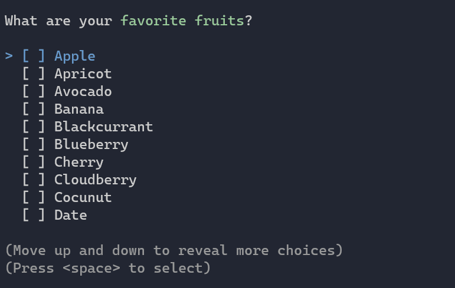

Title: Multi Selection
Order: 3
---

The `MultiSelectionPrompt` can be used when you want the user to select
one or many items from a provided list.



<div class="alert alert-warning" role="alert" style="margin-top:20px;">
  <i class="fas fa-exclamation-triangle icon-web"></i> The use of prompts 
  insides status or progress displays is not supported.
</div>

# Usage

```csharp
// Ask for the user's favorite fruits
var fruits = AnsiConsole.Prompt(
    new MultiSelectionPrompt<string>()
        .Title("What are your [green]favorite fruits[/]?")
        .NotRequired() // Not required to have a favorite fruit
        .PageSize(10)
        .MoreChoicesText("[grey](Move up and down to reveal more fruits)[/]")
        .InstructionsText(
            "[grey](Press [blue]<space>[/] to toggle a fruit, " + 
            "[green]<enter>[/] to accept)[/]")
        .AddChoice("Apple")
        .AddChoices(new[] {
            "Apricot", "Avocado", 
            "Banana", "Blackcurrant", "Blueberry",
            "Cherry", "Cloudberry", "Cocunut",
        }));

// Write the selected fruits to the terminal
foreach (string fruit in fruits) 
{
    AnsiConsole.WriteLine(fruit);
}
```