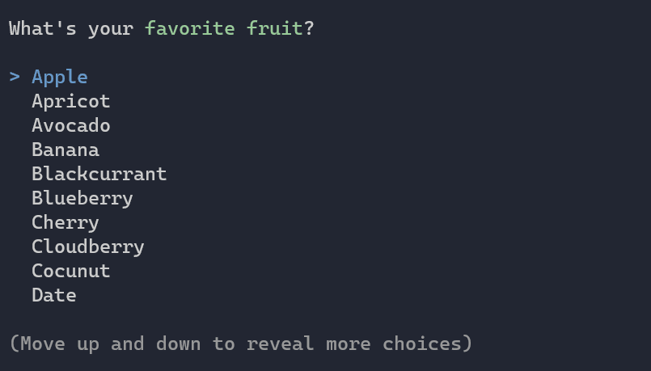

Title: Selection
Order: 1
---

The `SelectionPrompt` can be used when you want the user to select
a single item from a provided list.



<div class="alert alert-warning" role="alert" style="margin-top:20px;">
  <i class="fas fa-exclamation-triangle icon-web"></i> Using prompts inside 
  status or progress displays, are not supported.
</div>

# Usage

```csharp
// Ask for the user's favorite fruit
var fruit = AnsiConsole.Prompt(
    new SelectionPrompt<string>()
        .Title("What's your [green]favorite fruit[/]?")
        .PageSize(10)
        .MoreChoicesText("[grey](Move up and down to reveal more fruits)[/]")
        .AddChoice("Apple")
        .AddChoices(new[] {
            "Apricot", "Avocado", 
            "Banana", "Blackcurrant", "Blueberry",
            "Cherry", "Cloudberry", "Cocunut",
        }));

// Echo the fruit back to the terminal
AnsiConsole.WriteLine($"I agree. {fruit} is tasty!");
```