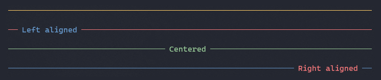

Title: Rule
Order: 5
RedirectFrom: rule
---

The `Rule` class is used to render a horizontal rule (line) to the terminal.



# Usage

To render a rule, create a `Rule` instance.

```csharp
var rule = new Rule();
AnsiConsole.Render(rule);
```

## Title

You can set the rule title markup text.

```csharp
var rule = new Rule("[red]Hello[/]");
AnsiConsole.Render(rule);

// output
───────────────────────────────── Hello ─────────────────────────────────
```

### Title alignment

You can set the rule's title alignment.

```csharp
var rule = new Rule("[red]Hello[/]");
rule.Alignment = Justify.Left;
AnsiConsole.Render(rule);

//output
── Hello ────────────────────────────────────────────────────────────────
```

You can also specify it with a method

```csharp
var rule = new Rule("[red]Hello[/]");
rule.LeftAligned();
AnsiConsole.Render(rule);

//output
── Hello ────────────────────────────────────────────────────────────────
```


## Style

You can set the rule style.

```csharp
var rule = new Rule("[red]Hello[/]");
rule.Style = Style.Parse("red dim");
AnsiConsole.Render(rule);
```
You can also specify it with a method

```csharp
var rule = new Rule("[red]Hello[/]");
rule.SetStyle("red dim");
AnsiConsole.Render(rule);
```
