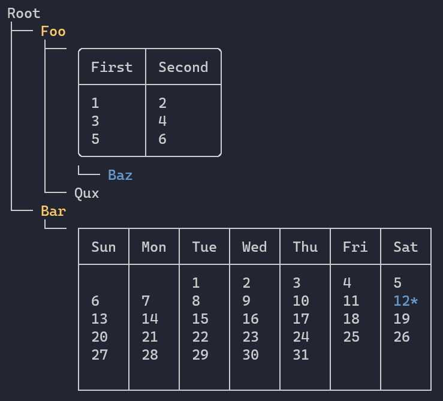

Title: Tree
Order: 10
---

The `Tree` widget can be used to render hierarchical data.



# Usage

```csharp
// Create the tree
var tree = new Tree("Root");

// Add some nodes
var foo = tree.AddNode("[yellow]Foo[/]");
var table = foo.AddNode(new Table()
    .RoundedBorder()
    .AddColumn("First")
    .AddColumn("Second")
    .AddRow("1", "2")
    .AddRow("3", "4")
    .AddRow("5", "6"));

table.AddNode("[blue]Baz[/]");
foo.AddNode("Qux");

var bar = tree.AddNode("[yellow]Bar[/]");
bar.AddNode(new Calendar(2020, 12)
    .AddCalendarEvent(2020, 12, 12)
    .HideHeader());

// Render the tree
AnsiConsole.Render(root);
```

# Collapsing nodes

```csharp
root.AddNode("Label").Collapsed();
```

# Appearance

## Style

```csharp
var root = new Tree("Root")
    .Style("white on red");
```

## Guide lines

```csharp
// ASCII guide lines
var root = new Tree("Root")
    .Guide(TreeGuide.Ascii);

// Default guide lines
var root = new Tree("Root")
    .Guide(TreeGuide.Line);

// Double guide lines
var root = new Tree("Root")
    .Guide(TreeGuide.DoubleLine);

// Bold guide lines
var root = new Tree("Root")
    .Guide(TreeGuide.BoldLine);
```